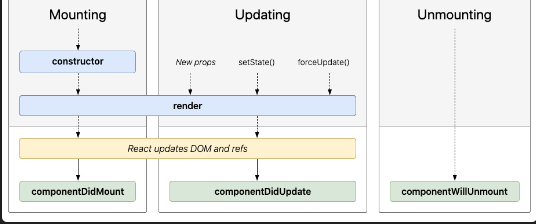

# react_1

**Last updated:** _2023-10-06_

```
import ReactDOM from "react-dom";

const App = () => {
  return null;
};

ReactDOM.render(<App />, document.getElementById("root"));


<!-- index.html -->
<!DOCTYPE html>
<html lang="en">
  <head>
    (...)
  </head>
  <body>
    (...)
    <div id="root"></div>
  </body>
</html
```

```
import ReactDOM from "react-dom";

const App = () => {
  return <h1>Hello!</h1>;
};

ReactDOM.render(<App />, document.getElementById("root"));
```

## JSX の規則

- return 以降に服す行がある場合、()で囲む

- return 以降 javascript code を使う場合は、{}を使う

- return 以降は tag 一個で囲む

```
import ReactDOM from "react-dom";

const App = () => {
  return (
    <div>
      <h1>Hello!</h1>
      <p>こんにちは！</p>
    </div>
  );
};

ReactDOM.render(<App />, document.getElementById("root"));
```

## Fragment

- 必ずコンポーネントを return する時、div タグなどを囲んで return しないといけない react の JSX の書き方で div などの無駄なタグを生成させず(レンダリングパフォーマンスにこだわって)に fragment というタグを囲むことで効率的に開発ができる。

- div の書き方

```
import React from 'react';

function MyComponent() {
    return (
        <div>
            <h1>ヘッダ-!</h1>
            <p>pタグの内容</p>
        </div>
    );
}
```

### fragment の書き方

```
import React from 'react';

function List() {
    return (
        <React.Fragment>
            <h2>一覧</h2>
            <ul>
                <li>list 1</li>
                <li>list 2</li>
                <li>list 3</li>
            </ul>
        </React.Fragment>
    );
}

export default List;
```

```
import React from 'react';

function Profile() {
    return (
        <>
            <h1>profile</h1>
            <p>名前: 太郎</p>
            <p>年齢: 30歳</p>
        </>
    );
}

export default Profile;
```

```
import React from 'react';

function TodoList() {
    const todos = [
        { id: 1, text: '日程確認' },
        { id: 2, text: 'コードレビュー' },
        { id: 3, text: '会議' },
    ];

    return (
        <ul>
            {todos.map(todo => (
                <React.Fragment key={todo.id}>
                    <li>{todo.text}</li>
                </React.Fragment>
            ))}
        </ul>
    );
}

export default TodoList;
```

```
import React from 'react';

function Dashboard() {
    return (
        <React.Fragment>
            <h2></h2>
            <React.Fragment>
                <p></p>
                <p></p>
            </React.Fragment>
            <p></p>
        </React.Fragment>
    );
}

export default Dashboard;
```

## event, css

```
export const App = () => {
  const onClickButton = () => {
    alert();
  };

  return (
    <>
      <h1>Hello!</h1>
      <p>こんにちは!</p>
      <button onClick={onClickButton}>버튼</button>
    </>
  );
};


// App.js
export const App = () => {

  const contentStyle = {
    color : "red",
    fontSize : "20px"
  };

  return (
    <>
      <h1 style={{color: "blue"}}>Hello!</h1>
      <p style={contentStyle}>!</p>
      <button onClick={onClickButton}></button>
    </>
  );
};
```

## props, state, lifecycle

### lifecycle の例



### props

```
// 普通の
 export const ColoredMessage = () => {
   const contentStyle = {
      color : "red",
      fontSize : "20px"
    };

    return <p style={contentStyle}>안녕하세요!</p>
 };

↓
// propsを定義したver
 export const ColoredMessage = (props) => {
   const contentStyle = {
      color : props.color,
      fontSize : "20px"
    };

    return <p style={contentStyle}>{props.message}</p>
 };


// おや側
  return (
    <>
      <h1 style={{color: "blue"}}>Hello!</h1>
      <ColoredMessage color="red" message="안녕하세요!"/>
      <button onClick={onClickButton}>버튼</button>
    </>
  );
};
```

### state

```
import { useState } from "react";
import { ColoredMessage } from "./components/ColoredMessage";

// App.js
export const App = () => {
  // State 定義
  const [num, setNum] = useState(0);

  const onClickButton = () => {
    setNum(num + 1);
  };

  return (
    <>
      <h1 style={{color: "blue"}}>Hello!</h1>
      <ColoredMessage color="red">hi!</ColoredMessage>
      <ColoredMessage color="pink">hello!</ColoredMessage>
      <button onClick={onClickButton}>button</button>
      <p>{num}</p>
    </>
  );
};
```
